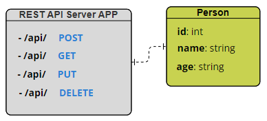

# A simple REST API capable of CRUD operations on a "person" resource.

This project provides a simple REST API for managing person records, allowing you to perform CRUD (Create, Read, Update, Delete) operations. This README.md file contains detailed instructions on setting up, running, and using the API.

> Swagger UI for the API is hosted on [SwaggerUI](https://hgnxbackend-prmpsmart.b4a.run/docs)
>
> LIVE API Endpoint is https://hgnxbackend-prmpsmart.b4a.run/api
>
> For the documentation go to [DOCUMENTATION.md](DOCUMENTATION.md)
>
> For the testing script go to [test.py](test.py)

## Table of Contents

- [Model Diagrams](#model-diagrams)
- [Prerequisites](#prerequisites)
- [Getting Started](#getting-started)
  - [1. Clone the Repository](#1-clone-the-repository)
  - [2. Install Dependencies](#2-install-dependencies)
  - [3. Run the API Locally](#3-run-the-api-locally)
- [API Endpoints](#api-endpoints)
- [Request/Response Formats](#requestresponse-formats)
- [Sample API Usage](#sample-api-usage)
- [Known Limitations and Assumptions](#known-limitations-and-assumptions)
- [Deployment](#deployment)

---

## Model Diagrams

- Unified Modeling Language (UML)
> 
-  Entity-Relationship Diagram (ERD)
> 

---

## Prerequisites

Before you begin, ensure you have met the following requirements:

- Python 3.7 or higher installed.
- Git installed (for cloning the repository).
- A code editor or IDE of your choice.

---

## Getting Started

Follow these steps to set up and run the API locally.

### 1. Clone the Repository

Clone this repository to your local machine:

```bash
git clone https://github.com/prmpsmart/hgnx_backend.git
cd hgnx_backend
```

### 2. Install Dependencies

Install the required Python dependencies using `pip`:

```bash
pip install -r requirements.txt
```

This will install FastAPI, Uvicorn, and any other necessary packages.

### 3. Run the API Locally

To run the API locally, use the following command:

```bash
uvicorn main:app
```

This will start the API server, and it will be available at `http://127.0.0.1:8000`.

---

## API Endpoints

The API provides the following endpoints for CRUD operations on the "Person" resource:

- **Create a Person**:
  - **POST /api/**
  - Add a new person to the database.

- **Read a Person**:
  - **GET /api/{name}**
  - Retrieve details of a person by name.

- **Update a Person**:
  - **PUT /api/{name}**
  - Modify details of an existing person by name.

- **Delete a Person**:
  - **DELETE /api/{name}**
  - Remove a person from the database by name.

---

## Request/Response Formats

### Create a Person (POST /api/)

**Request Format:**

```json
{
  "name": "Miracle Apata",
  "age": 24
}
```

**Response Format (Success - 200):**

```json
{
  "name": "Miracle Apata",
  "age": 24
}
```

### Read a Person (GET /api/{name})

**Response Format (Success - 200):**

```json
{
  "name": "Miracle Apata",
  "age": 24
}
```

**Response Format (Not Found - 404):**

```json
{
  "detail": "Person with 'Miracle Apata' already exists"
}
```

### Update a Person (PUT /api/{name})

**Request Format:**

```json
{
  "age": 35
}
```

**Response Format (Success - 200):**

```json
{
  "name": "Miracle Apata",
  "age": 35
}
```

**Response Format (Not Found - 404):**

```json
{
  "detail": "Person with 'Miracle Apata' already exists"
}
```

### Delete a Person (DELETE /api/{name})

**Response Format (Success - 200):**

```json
{
  "name": "Miracle Apata",
  "age": 35
}
```

**Response Format (Not Found - 404):**

```json
{
  "detail": "Person with 'Miracle Apata' already exists"
}
```

---

## Sample API Usage

Here are some sample API usage scenarios:

1. **Create a Person**:

   ```python
   import requests

   api_url = "http://127.0.0.1:8000/api/"
   live_api_url = "https://hgnxbackend-prmpsmart.b4a.run/api"

   data = {
       "name": "Alice Johnson",
       "age": 25
   }

   response = requests.post(api_url, json=data)
   print(response.json())
   ```

2. **Read a Person**:

   ```python
   import requests

   api_url = "http://127.0.0.1:8000/api/Alice%20Johnson"
   live_api_url = "https://hgnxbackend-prmpsmart.b4a.run/api/Alice%20Johnson"

   response = requests.get(api_url)
   print(response.json())
   ```

3. **Update a Person**:

   ```python
   import requests

   api_url = "http://127.0.0.1:8000/api/Alice%20Johnson"
   live_api_url = "https://hgnxbackend-prmpsmart.b4a.run/api/Alice%20Johnson"

   data = {
       "age": 26
   }

   response = requests.put(api_url, json=data)
   print(response.json())
   ```

4. **Delete a Person**:

   ```python
   import requests

   api_url = "http://127.0.0.1:8000/api/Alice%20Johnson"
   live_api_url = "https://hgnxbackend-prmpsmart.b4a.run/api/Alice%20Johnson"

   response = requests.delete(api_url)
   print(response.json())
   ```

---

## Known Limitations and Assumptions

- This API uses a Python built-in database (sqlite3) for demonstration purposes.
- Input validation is handled by FastAPI in this task. Implement more robust validation and error handling in a production-ready application.
- Authentication and authorization mechanisms are not implemented here. Ensure secure access to your API in a real-world scenario.
- This documentation assumes that you have successfully set up the API locally.

---

## Deployment

To deploy this API to a production server, follow the appropriate deployment practices for FastAPI applications. Ensure proper security measures, such as using HTTPS, implementing authentication, and securing sensitive data.

